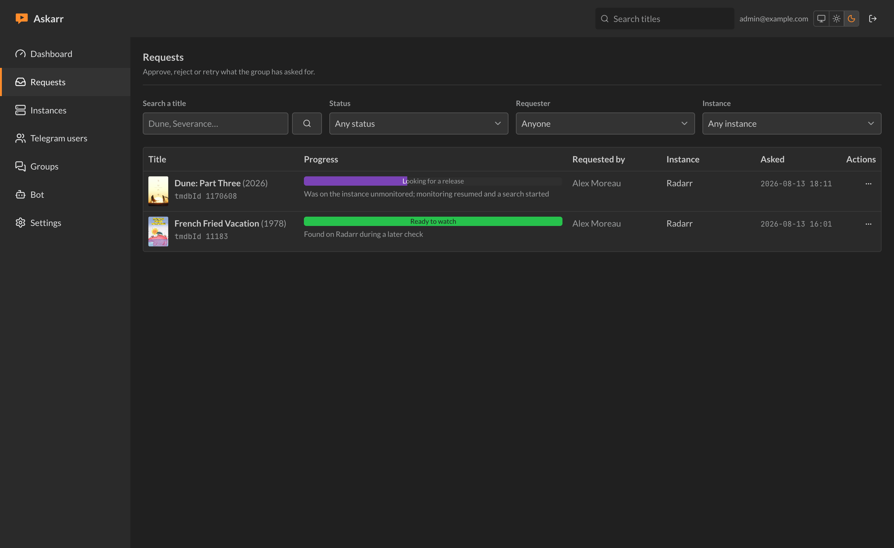
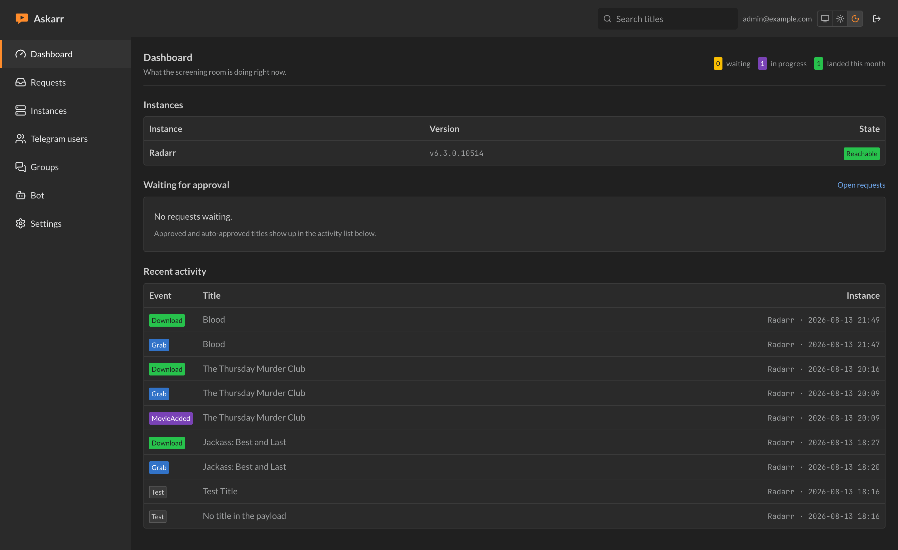
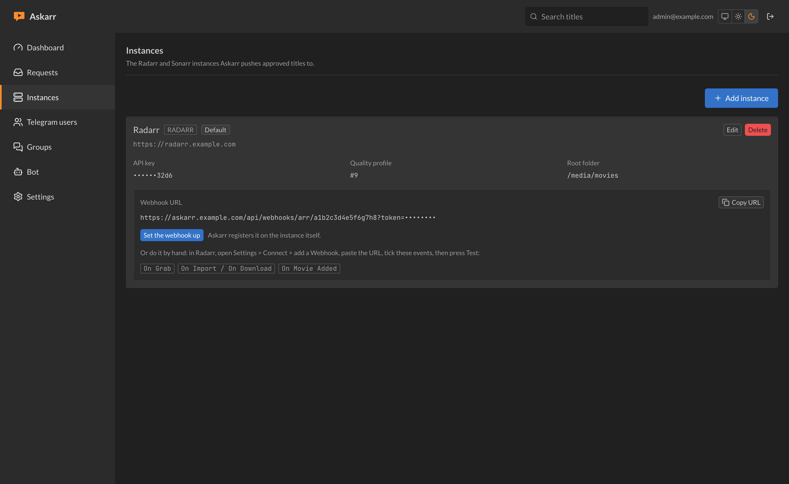
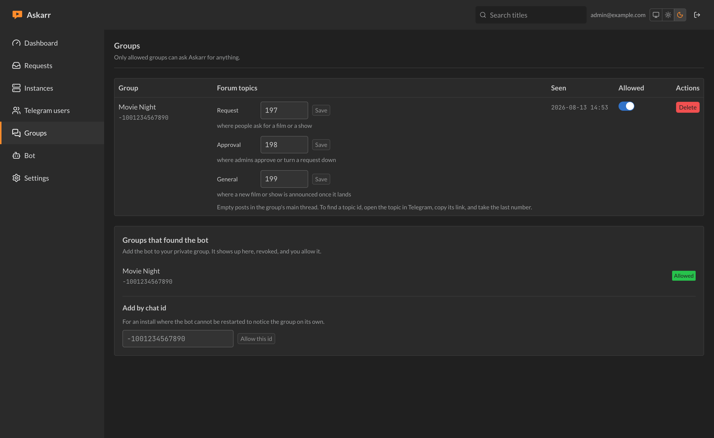

<div align="center">


# Askarr

**An \*arr for the people who watch, not the person who runs the server.**

Your circle asks for films and shows in Telegram. Askarr checks who they are,
puts it into Radarr or Sonarr, and tells them when it lands.

[](https://github.com/gothub97/askarr/actions/workflows/ci.yml)
[](https://github.com/gothub97/askarr/actions/workflows/release.yml)
[](https://github.com/gothub97/askarr/pkgs/container/askarr)

</div>

---

No Overseerr, no Jellyseerr, no Ombi, no Plex. Nothing to invite anyone to and
no second account for them to forget. Metadata comes from your own Radarr and
Sonarr `lookup` endpoints, so the only things Askarr talks to are Telegram and
the instances it serves.

## Screenshots

|  |  |
|---|---|
|  |  |
| **Requests**: what the group asked for, and how far it got. | **Dashboard**: what is waiting on you right now. |
|  |  |
| **Instances**: Radarr and Sonarr, with one-press webhook setup. | **Groups**: which chats may ask, and which topic does what. |

## Two surfaces

- **The Telegram bot**, where requests happen. Usable only from groups you have explicitly allowed.
- **The web back office**, for administration, behind its own login.

Everyone who asks for something stays in Telegram, with slash commands and
inline search. The back office is for the one person who runs the server, and
nobody else ever needs to open it.

---

## Install

You need Docker, and an address where Askarr is reachable from your Radarr and
Sonarr instances.

```bash
mkdir askarr && cd askarr
curl -O https://raw.githubusercontent.com/gothub97/askarr/main/docker-compose.yml
curl -o .env https://raw.githubusercontent.com/gothub97/askarr/main/.env.example
```

Edit `.env`. Two lines actually matter to start:

```ini
BETTER_AUTH_SECRET="<paste the output of: openssl rand -base64 32>"
APP_URL="https://askarr.example.com"
```

Then:

```bash
docker compose up -d
```

Open `APP_URL` and the first-run wizard takes over. Seven steps, and it walks
you through creating the bot with pictures, so you do not need the section
below unless you like reading ahead. Two of the seven are required, the bot and
your first group, because Askarr cannot do anything without them. Radarr and
Sonarr can wait.

You can leave and come back. The wizard sends you to Telegram twice and
remembers where you were, so closing the tab loses nothing.

The image is published to
[GHCR](https://github.com/gothub97/askarr/pkgs/container/askarr) for
`linux/amd64` and `linux/arm64`. `:latest` follows releases, `:edge` follows
`main`, and `ASKARR_TAG=v0.1.0` in `.env` pins a version.

> **`APP_URL` must be reachable *by your instances*, not just by your browser.**
> Radarr calls back to it over a webhook, and that webhook is the only way
> Askarr ever learns that something was grabbed or imported. An install where
> this is wrong looks identical to a working one until nothing is ever marked
> available.

---

## Setting up the bot

The wizard covers all of this, illustrated, at install time. It is written out
here for anyone changing a bot later, or reading before they install.

### 1. Create it and get the token

1. Open [@BotFather](https://t.me/botfather) and send `/newbot`.
2. Give it a display name, then a username ending in `bot`.
3. BotFather replies with a line like `123456789:AAH...`. **That is the token.**

Paste it into the wizard, or later into the back office under **Bot → New token
from BotFather**. `TELEGRAM_BOT_TOKEN` in `.env` still works as a seed for an
install that is being scripted. Whatever you save in the app wins over the
environment: it is checked with Telegram before it is saved, and the bot picks
it up within a second without a restart.

The token is stored encrypted and is never shown again, only its last four
characters, so you can tell two tokens apart without being able to use either.

### 2. Leave privacy mode on

`/setprivacy` → **Enable**. This is the default, and the whole design depends on
it: the bot sees commands and replies to its own messages, and nothing else.
Your group's conversation stays yours.

### 3. Turn inline mode on

`/setinline` → then send the placeholder people will see in the input field,
something like `Search for a film or show`.

**This one is off by default and easy to miss.** Without it, typing
`@yourbot dune` in a chat does nothing at all: no results, no error, nothing to
tell you a switch was never flipped. Privacy mode is not weakened by it, because
inline results are gated on identity rather than on chat. Only someone who has
already spoken in an allowed group gets any.

### 4. Add it to your group

Add the bot as a member and promote it to administrator. It shows up in the
wizard, or in the back office under **Groups**, not yet allowed, and you press
**Allow**.

A message from a group that has not been allowed produces no response at all:
not an error, not a refusal. Askarr never confirms to a stranger that it exists.

---

## Using forum topics

Optional, and worth it. Turn **Topics** on in your group settings, and Askarr
will keep the three kinds of message apart:

| Topic | What lands there |
|---|---|
| **Request** | where people ask for a film or a show |
| **Approval** | where admins approve or turn a request down |
| **General** | where a new film or show is announced once it lands |

The wizard offers this as step five, and the back office has it too: open
**Groups** and press **Create the missing topics**. Askarr creates them in
Telegram and stores their ids for you. Pressing it twice is safe, because it
only fills the purposes that are still unset.

To point a purpose at a topic you already have, open that topic in Telegram,
copy its link, and take the last number. That is the id the field wants.

<details>
<summary>Why there is no dropdown to pick from</summary>

The Bot API can *create* a forum topic but has no method to *list* them:
`createForumTopic` exists, `getForumTopics` does not. There is nothing to fill
a select box from, so creating them is the one path that ends with the right
ids and no copying of links by hand.

Telegram also refuses a reply that points into a different topic, which is why
a message crossing topics mentions the person instead of replying to them.
</details>

---

## Connecting Radarr and Sonarr

Add an instance in the back office, press **Test connection**, then pick a
quality profile and root folder from what the instance reports.

Then press **Set the webhook up**. Askarr registers it on the instance over the
API, so there is no URL to paste into Settings → Connect and no forgetting which events
to tick. The events it needs are read off the instance's own schema, because
Radarr and Sonarr name them differently and the set grows between versions.

Two things worth knowing:

- **Path prefixes work.** An instance at `https://host/admin/radarr` is joined
  correctly rather than having its prefix stripped.
- **Self-signed certificates** are handled per instance, through a dedicated
  dispatcher. Askarr never disables TLS validation process-wide.

---

## Who can request what

| Role | |
|---|---|
| `BLOCKED` | No reaction at all |
| `GUEST` | Every request waits for approval |
| `TRUSTED` | Auto-approved while inside the rolling 30-day quota |
| `ADMIN` | Auto-approved, no quota |

Everyone starts as `GUEST` with five requests a month. A full series always
goes through review, even for a trusted user, because it can trigger hundreds
of grabs; a single season does not.

Quota counts requests over a rolling 30-day window, not bytes and not
calendar months.

### Commands

| | |
|---|---|
| `/movie <title>` | Search for a movie |
| `/series <title>` | Search for a show |
| `/requests` | Your ten most recent requests |
| `/admin` | Approval queue, admins only |
| `/help` | Command reminder |

There is also inline mode: type `@yourbot dune` in the group and pick from the
results without a slash command at all. It needs `/setinline` in BotFather
first, which the wizard walks you through.

---

## How a request travels

Two people asking for the same film on the same instance produce **one**
`MediaItem` and **two** `Subscription` rows. Both get told; the film is added
once.

Askarr asks the instance before it claims anything about your library. A title
Radarr already has is recorded as such and nothing is sent. A title Radarr
knows but is not monitoring gets monitoring turned back on and a search
started, rather than a comfortable "already there" that would leave you waiting
for a file that was never coming.

Notifications arrive as a reply to the message that asked. If that message is
gone, Askarr falls back to a plain message carrying an inline mention, built
as a `tg://user` link, because not every member has a `@username`. A completed
season produces one notification, never one per episode.

---

## Development

```bash
npm install
docker compose up -d postgres
npm run db:push
npm run dev      # web
npm run dev:bot  # bot, in a second terminal
```

| Script | |
|---|---|
| `npm run dev` / `dev:bot` | the two processes |
| `npm run build` / `start` | production web |
| `npm run start:bot` | production bot |
| `npm run db:migrate` | apply migrations |
| `npm run typecheck` | strict TypeScript |
| `npm test` | unit tests |

The tests that touch a database are skipped unless `ASKARR_TEST_DB=1` **and**
the database name contains `test`. Both conditions, because a dev database
holds real API keys and a real bot token.

**Design:** [`DESIGN.md`](DESIGN.md) records the visual system. Askarr wears
the \*arr interface language on purpose, so it sits beside Radarr without
looking like a different product. [`PRODUCT.md`](PRODUCT.md) records what the
thing is and who it is for.

## Licence

MIT.
